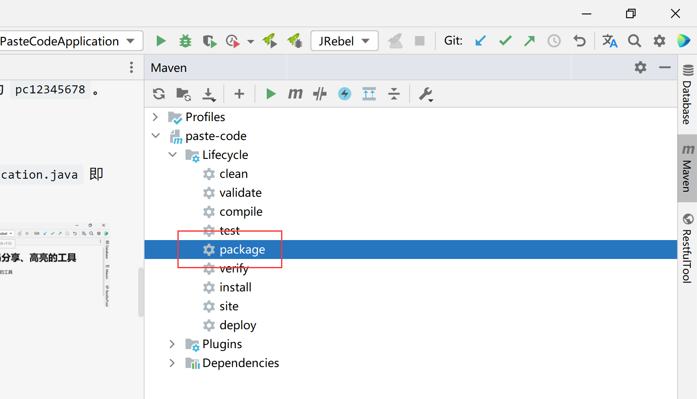

# 部署
## 数据库初始化
首先需要在本地连接到 MySQL 数据库，执行 `scripts/sql_int.sql` 文件。该文件的作用为：新建 MySQL 的 schema，然后新建数据库表。schema 名默认为 paste_code。如果有该表，那么直接执行 create 语句即可。

然后为数据库新建一个用户，并授权所有权限。用户名和密码参见 `application.yml` 文件中所示，或者如下：
```yaml
username: paste_code
password: pc12345678
```
当然如果不想新建，那么也可以使用自己默认的用户名，比如 root。
## 项目启动
首先需要 Java 17 的运行环境，可以去 [Oracle 官网](https://www.oracle.com/java/technologies/downloads/#java17) 或者去 [OpenJDK 官网](https://jdk.java.net/17/) 下载即可。
### IDEA 内启动应用
将代码 clone 至 IDEA 中，然后重新刷新导入 Maven 依赖，如图


然后启动应用即可。

如果需要修改 MySQL 用户名等信息，在 `application.yml` 配置文件中直接修改即可。
### Jar 包启动
去 [release](https://github.com/sleepybear1113/paste-code/releases) 页面下载最新的 Jar 包。

如果自己打包 Jar 的话，可以在 IDEA 中右侧 Maven 中点击 package 进行打包 Jar 即可，如图

#### 快速启动
最简单的启动方式为：
```shell
java -jar paste-code-最新版本号.jar
```
该种启动方式需要有对应 Java 17 的环境变量，然后就能在控制台前台运行了。默认的访问地址为：`http://127.0.0.1:24517/paste.html`
#### 使用其他版本 Java 运行
如果当前默认 Java 版本不为 17，那么可以指定运行的版本，如 Java 17 的包在 `/home/java/17.0.2` 下，那么可以使用以下命令：
```shell
# Linux 环境
/home/java/17.0.2/bin/java -jar paste-code-最新版本号.jar

# Windows 环境（如 Java 包在 D:/java/17.0.2 路径下）
D:/java/17.0.2/bin/java.exe -jar paste-code-最新版本号.jar
```
#### 在后台运行
Linux 环境下，可以使用 nohup 命令来做到关闭终端也能后台运行，命令如下：
```shell
nohup java -jar paste-code-最新版本号.jar &
```
要想中止运行，那么需要先找到进程号 pid，命令为：
```shell
ps -ef | grep 'paste-code'
```
然后执行 kill 即可，如下：
```shell
kill -9 pid
```
### 修改配置文件
如果是在 IDEA 中启动，那么直接修改 `application.yml` 文件即可。如果使用 Jar 包运行的，那么需要自己修改 yml 文件。

在 Jar 包同路径下新建 `application-dev.yml` 文件，如果想修改 MySQL 的用户名，例如如下：
```yaml
# application-dev.yml 文件
spring:
  datasource:
    url: jdbc:mysql://10.0.0.123:3306/paste_code?useUnicode=true&characterEncoding=utf-8&serverTimezone=Asia/Shanghai
    username: root
    password: 123456
```
上述配置文件可以修改 MySQL 的地址和用户名，同时保留启动端口为 24517 不变。

要想更多自定义，那么在 yml 文件内新增配置项即可。

因为这个 yml 文件的后缀为 `dev` 即 `xxxxx-dev.yml`，那么使用 Jar 包的启动方式就改为了如下
```shell
nohup java -jar paste-code-最新版本号.jar --spring.profiles.active=dev &
```
## 前后端分离配置
前后端分离的好处就是，前端工程能自顾自启动，不依赖于后端工程。当后端工程挂了，前端也能进行粘贴代码进行高亮显示，但是不能保存到数据库生成 URL 地址。

将 `src/resources/static` 文件夹下的文件复制出来，通过 Nginx 暴露出去，同时修改 `src/main/resources/static/js/properties/properties.js` 的请求路径，根据 Nginx 不同配置不同的 base URL 地址即可。

Nginx 的配置可以参考如下
```nginx
location ^~ /code {
    # 静态文件路径
    alias /home/paste-code/static/;
    index paste.html;
}

location ^~ /api24517 {
    proxy_pass http://127.0.0.1:24517;
    proxy_set_header Host $host;
    proxy_set_header X-Real-IP $remote_addr;
    proxy_set_header X-Forwarded-For $proxy_add_x_forwarded_for;
}
```