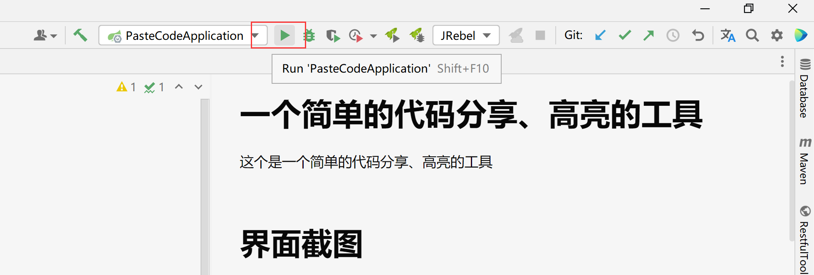
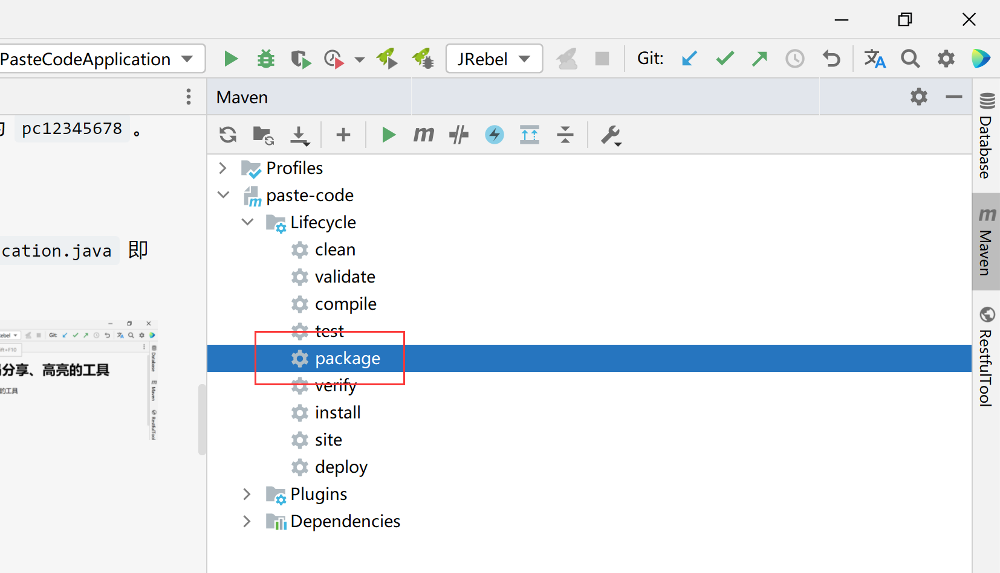

# 一个简单的代码分享、高亮的工具

这是一个简单的代码分享、高亮的工具

# 界面截图


# 工具简介

## 后端
基于 `Spring Boot 3.0.0-M1` 的 `Java 17` 构建。使用 `MySQL` 作为存储代码的数据库，并使用 `MyBatis plus` 来连接。

## 前端
使用 [highlight.js](https://github.com/highlightjs/highlight.js) 来实现代码高亮。

使用 [highlightjs-line-numbers.js](https://github.com/wcoder/highlightjs-line-numbers.js) 来实现代码行号。

并且加以简单的 HTML、JavaScript 构成页面，暂时不使用前端框架。

## 部署方式

### 数据库配置

默认数据库为本地 `127.0.0.1:3306` 的 MySQL 数据库。如果本地有 MySQL 服务，那么需要新建一个名为 `paste_code` 的 schema，并且在 `paste_code` 下新建一个名为 `code` 的表，表结构如下

```mysql
create table paste_code.code
(
    id          int auto_increment primary key,
    create_time bigint      null,
    modify_time bigint      null,
    user_id     int         null,
    language    varchar(31) not null comment '代码语言',
    style       varchar(31) not null comment '代码风格',
    code        mediumtext  not null
);
```

表建立完成后，需要新建一个用户，用户名密码如若不修改，请参见 `application.yml` 文件中，用户名为 `paste_code`，密码为 `pc12345678`。

### IDEA 启动

运行 `PasteCodeApplication.java` 即可，如图




### Jar 包启动

#### 自己打包 Jar

clone 本工程到 IDEA 中，在右侧 Maven 中点击 package 进行打包 Jar 即可，如图



#### 下载打包好的 Jar

在此处下载：[release](https://github.com/sleepybear1113/paste-code/releases)

#### 启动

在 Java 17 的环境下，使用以下命令来启动项目

```shell
java -jar paste-code-0.0.2-SNAPSHOT.jar
```

如果本机默认的环境不是 Java 17，那么需要去下载 Java 17 的包，然后找到 Java 17 的路径，例如路径为 `/home/java/17.0.2/` 则命令可以为
```shell
/home/java/17.0.2/bin/java -jar paste-code-0.0.2-SNAPSHOT.jar
```

若想要在后台运行，那么使用 `nohup` 命令运行，如下
```shell
nohup java -jar paste-code-0.0.2-SNAPSHOT.jar &
```

若想要停止应用，那么需要找到这个应用对应的 pid 进程号。使用以下命令来获取 pid
```shell
ps -ef | grep 'paste-code'
```
然后执行命令即可中止。
```shell
kill -9 找到的 pid
```

## 工具访问

### 前后端不分离

如果不配置 Nginx 不走前后端分离的方式，那么无须更改前端 URL 路径，直接通过 `ip:端口/paste.html` 即可访问，如
```http request
http://127.0.0.1:24517/paste.html
```

其中端口号 `24517` 在 `application.yml` 文件中有定义，`paste.html` 路径为工程的 HTML 文件名，路径在 `src/main/resources/static/paste.html` 下。如果把 HTML 文件名改为 `index.html` 那么无须添加后缀即可访问，如 `http://127.0.0.1:24517` 的链接。

### 前后端分离

前后端分离的好处就是，前端工程能自顾自启动，不依赖于后端工程。当后端工程挂了，前端也能进行粘贴代码进行高亮显示，但是不能保存到数据库生成 URL 地址。

将 `src/resources/static` 文件夹下的文件复制出来，通过 Nginx 暴露出去，同时修改 `src/main/resources/static/js/properties/properties.js` 的请求路径，根据 Nginx 不同配置不同的基础 URL 地址即可。

# 为什么写这个工具

1. 闲着没事写着玩。
2. 想自己搞个能贴代码的并且有代码高亮显示的工具。
3. 网上开源的部署起来有点麻烦，想搞个简便点的，但是功能会很少。

## 后续方向

后续如果再闲着没事，那么佛系更新，考虑加入过期时间、用户功能等，但是目前没有精力搞这些，只是想着能用就行。

# 版本功能

## v0.1.1
- [优化] 代码时间显示

## v0.1.0
- [新增] 使用 `highlight.js` 中全部支持的语言
- [新增] 代码时间显示
- [优化] 使用 `highlight.js` 自带的检测语言功能
- [优化] 使用 dto 对象来转换 Java entity 层到 service 层
- [优化] 优化前后端的代码逻辑

## v0.0.2
- 初始化项目
- 简单的代码存储和展示功能
- 简单的加密 id 功能

