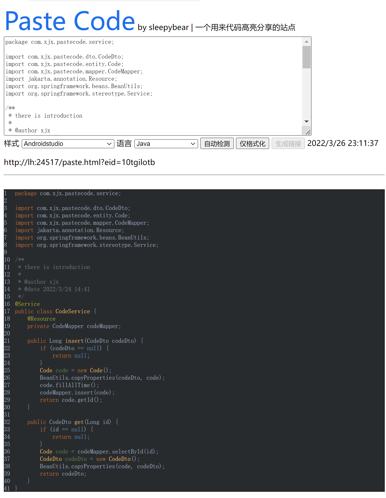

# 一个简单的代码分享、高亮的工具
这是一个简单的代码分享、高亮的工具
# 纯静态前端地址
[https://sleepybear1113.github.io/paste-code/src/main/resources/static/paste.html](https://sleepybear1113.github.io/paste-code/src/main/resources/static/paste.html)
# 界面截图

# 工具简介
## 后端
基于 `Spring Boot 3.0.0-M2` 的 `Java 17` 构建。使用 `MySQL` 作为存储代码的数据库，并使用 `MyBatis plus` 来连接。
## 前端
使用 [highlight.js](https://github.com/highlightjs/highlight.js) 来实现代码高亮。

使用 [highlightjs-line-numbers.js](https://github.com/wcoder/highlightjs-line-numbers.js) 来实现代码行号。

并且加以简单的 HTML、JavaScript 构成页面，暂时不使用前端框架。
# 部署方式
需要简单地配置一下 MySQL 数据库进行表的新建，然后在 IDEA 中启动工程或者直接下载 Jar 包进行启动即可。具体步骤请查看文档 [deploy](markdown/deploy.md)
# 为什么写这个工具
1. 闲着没事写着玩。
2. 想自己搞个能贴代码的并且有代码高亮显示的工具。
3. 网上开源的部署起来有点麻烦，想搞个简便点的，但是功能会很少。
## 后续方向
后续如果再闲着没事，那么佛系更新，考虑加入过期时间、用户功能等，但是目前没有精力搞这些，只是想着能用就行。
# 版本功能
## v0.1.3
- [升级] 升级 Spring Boot 版本至 3.0.0-M2
- [新增] logback 配置文件
- [修改] 修改包名为 cn.xiejx
## v0.1.2
- [新增] admin key 可配置化
- [优化] 不存在 id 导致转 dto 出现 npe 问题
## v0.1.1
- [优化] 代码时间显示
## v0.1.0
- [新增] 使用 `highlight.js` 中全部支持的语言
- [新增] 代码时间显示
- [优化] 使用 `highlight.js` 自带的检测语言功能
- [优化] 使用 dto 对象来转换 Java entity 层到 service 层
- [优化] 优化前后端的代码逻辑
## v0.0.2
- 初始化项目
- 简单的代码存储和展示功能
- 简单的加密 id 功能